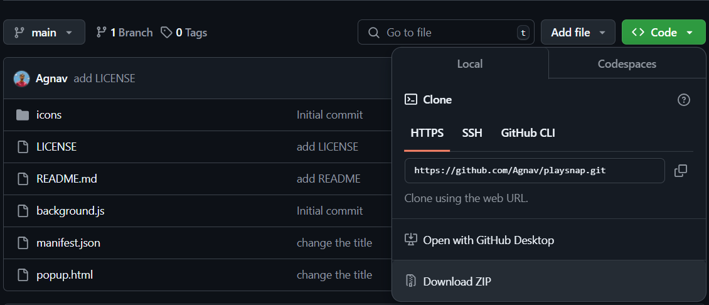
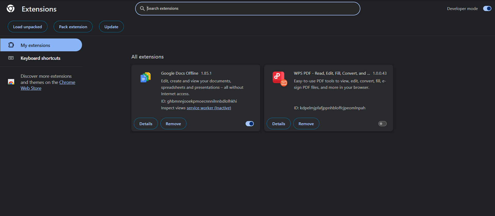
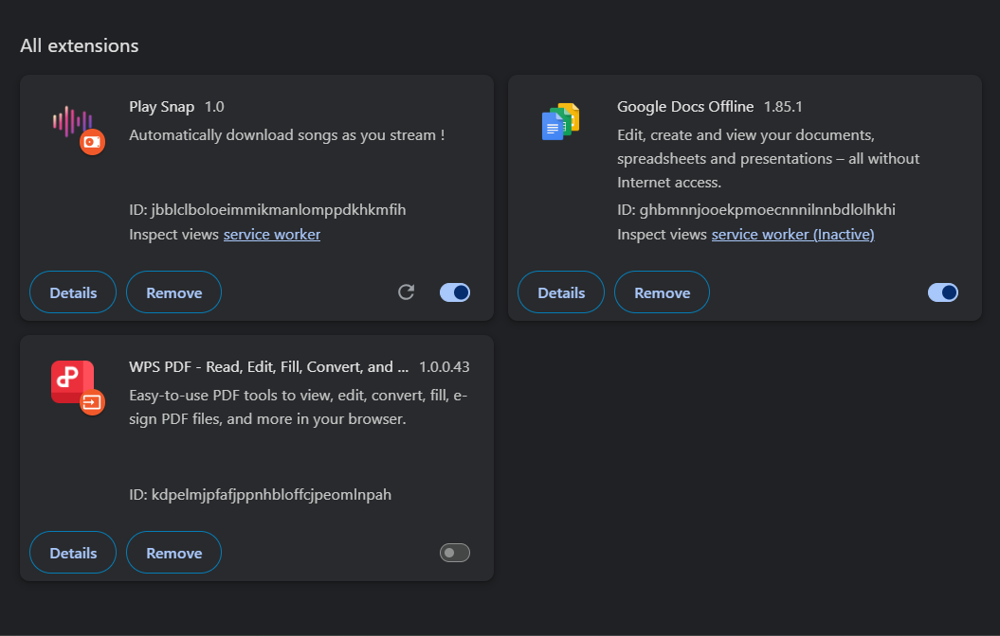

# Play Snap

**Play Snap** is a browser extension that automatically downloads songs as you stream them on JioSaavn. The extension listens for specific API calls and downloads the media directly to your system in M4A format.

## Features

- **Automatic Download**: The extension listens to JioSaavn API calls and automatically triggers song downloads when available.
- **Playlist Support**: Supports both individual songs and playlist-based music downloads.
- **Download Management**: Downloads songs in MP3 format and handles overwrites if a file already exists.

## Installation
 1. Clone this repository to your local machine 
   ```bash
   git clone https://github.com/Agnav/playsnap.git
   ```
   or download as a zipfile and extract it in your local system:

# 

2. Open Chrome and navigate to `chrome://extensions`.

3. Enable **Developer mode** by toggling the switch in the top right corner.

4. Click **Load unpacked** and select the folder where you cloned the project.

# 

5. Once loaded, the extension icon will appear in your Chrome toolbar.

# 

## How It Works

The extension listens for certain API calls from JioSaavn, specifically:

- **Album/Playlist Details**: When a playlist or album is accessed, the extension retrieves the list of songs.
- **Song Details**: When the details of a song are accessed, it prepares the song for download.
- **Auth Token Generation**: Once an authentication token is fetched, it will use that to initiate the song download and save it in the MP3 format.

## Known Issues

- The extension only works with JioSaavn and may not work with other music streaming platforms.
- There may be occasional issues if the playlist or song details are not properly fetched.

## Contributing

Feel free to fork the repository and submit pull requests. If you find any issues, please open an issue in the GitHub repository.

## License

This project is licensed under the MIT License - see the [LICENSE](LICENSE) file for details.
